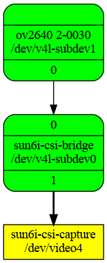

# PINE A64+
## Product Introduction
The [Pine64](https://linux-sunxi.org/Pine64) is a cost-optimized board sporting ARMv8 (64-bit ARM) capable cores. It was one of the first available boards with a 64-bit Allwinner chip, and one of the first affordable boards with an 64-bit ARM core in general.


## Features and Specifications

|     |                                   |
|----|------------------------------------|
| SoC| 4 x ARM Cortex A53 cores @ 1.152 GHz|
|GPU| ARM Mali 400 MP2 GPU|
  |Memory| DDR3 RAM (up to 2GB)|
  |Networking| Gigabit Ethernet|
  |Flash Memory| Micro SD|
  |Connections| |
  || <br>HD digital video out<br>2x USB 2.0 Host<br>Euler bus<br>Expansion bus<br>PI-2 bus<br>Touch Panel (TP) port<br>Display Serial Interface (DSI) port<br>IR R/X port<br>Real Time Clock Port (RTC)<br>Lithium battery port<br>CMOS Sensor Interface port<br>Optional expansion module with 802.11 b/g/n WiFI and Bluetooth 4.0<br>3.5mm headphone jack<br>Micro USB power (5V 2A) port|


* Releases:
  * [Kernel 6.9.2](#kernel-6.9.2)
  * [U-Boot 2024.04 ](#u-boot)
  * [Debian 12(bookworm)](https://www.debian.org/News/2023/20230610)

## U-boot

U-Boot 2024.04


* Pre-built

```sh
    https://github.com/yjdwbj/sun50i-a64-pine64/archive/refs/tags/v1.0.tar.gz
```


## Kernel 6.9.2

Kernel 6.9.2 is rock solid in Pine64+, building **Kernel 6.9.2** with gcc-12 on uSD for testing new devfreq and checking stability.
The board works great in real time using Gstreamer and a hardware h264 encoder.


Testing mainline **6.9.2**, current status:

* Eth0 - ok
* Wifi Realtek 8732BS (SDIO) - ok
* USB2 - ok
* DVP camera - ok (for ov2640 sccb)
* [cedrus encoding for H.264](https://linux-sunxi.org/VE_Register_guide) - ok

## Benchmarks

* CPU info

```sh
pine@pine64-plus:~$ lscpu
Architecture:             aarch64
  CPU op-mode(s):         32-bit, 64-bit
  Byte Order:             Little Endian
CPU(s):                   4
  On-line CPU(s) list:    0-3
Vendor ID:                ARM
  Model name:             Cortex-A53
    Model:                4
    Thread(s) per core:   1
    Core(s) per cluster:  4
    Socket(s):            -
    Cluster(s):           1
    Stepping:             r0p4
    BogoMIPS:             48.00
    Flags:                fp asimd evtstrm aes pmull sha1 sha2 crc32 cpuid
NUMA:
  NUMA node(s):           1
  NUMA node0 CPU(s):      0-3
Vulnerabilities:
  Gather data sampling:   Not affected
  Itlb multihit:          Not affected
  L1tf:                   Not affected
  Mds:                    Not affected
  Meltdown:               Not affected
  Mmio stale data:        Not affected
  Reg file data sampling: Not affected
  Retbleed:               Not affected
  Spec rstack overflow:   Not affected
  Spec store bypass:      Not affected
  Spectre v1:             Mitigation; __user pointer sanitization
  Spectre v2:             Not affected
  Srbds:                  Not affected
  Tsx async abort:        Not affected

pine@pine64-plus:~$ cat /proc/cpuinfo
processor	: 0
BogoMIPS	: 48.00
Features	: fp asimd evtstrm aes pmull sha1 sha2 crc32 cpuid
CPU implementer	: 0x41
CPU architecture: 8
CPU variant	: 0x0
CPU part	: 0xd03
CPU revision	: 4

processor	: 1
BogoMIPS	: 48.00
Features	: fp asimd evtstrm aes pmull sha1 sha2 crc32 cpuid
CPU implementer	: 0x41
CPU architecture: 8
CPU variant	: 0x0
CPU part	: 0xd03
CPU revision	: 4

processor	: 2
BogoMIPS	: 48.00
Features	: fp asimd evtstrm aes pmull sha1 sha2 crc32 cpuid
CPU implementer	: 0x41
CPU architecture: 8
CPU variant	: 0x0
CPU part	: 0xd03
CPU revision	: 4

processor	: 3
BogoMIPS	: 48.00
Features	: fp asimd evtstrm aes pmull sha1 sha2 crc32 cpuid
CPU implementer	: 0x41
CPU architecture: 8
CPU variant	: 0x0
CPU part	: 0xd03
CPU revision	: 4
```

* login motd

```sh
 ____  _             __   _  _
|  _ \(_)_ __   ___ / /_ | || |    _
| |_) | | '_ \ / _ \ '_ \| || |_ _| |_
|  __/| | | | |  __/ (_) |__   _|_   _|
|_|   |_|_| |_|\___|\___/   |_|   |_|

Welcome to Debian GNU/Linux 12 (bookworm) with Linux 6.9.2-pine64-plus

System load:   28%           	Up time:       5:00
Memory usage:  6% of 1.94G  	IP:	       192.168.1.145
CPU temp:      29°C
RX today:      13.7 MiB

Last login: Wed May 29 11:07:13 2024 from 192.168.1.100


```

* 7zr b
```sh
pine@pine64-plus:~$ 7zr b

7-Zip (a) [64] 16.02 : Copyright (c) 1999-2016 Igor Pavlov : 2016-05-21
p7zip Version 16.02 (locale=en_US.UTF-8,Utf16=on,HugeFiles=on,64 bits,4 CPUs LE)

LE
CPU Freq: 3555555 4571428 3047619 64000000 128000000 - 512000000 68266666 93090909

RAM size:    1984 MB,  # CPU hardware threads:   4
RAM usage:    882 MB,  # Benchmark threads:      4

                       Compressing  |                  Decompressing
Dict     Speed Usage    R/U Rating  |      Speed Usage    R/U Rating
         KiB/s     %   MIPS   MIPS  |      KiB/s     %   MIPS   MIPS

22:       1476   309    464   1436  |      35484   397    762   3027
23:       1467   317    472   1495  |      34994   398    760   3028
24:       1449   324    481   1558  |      34366   398    758   3017
25:       1432   334    490   1635  |      33667   398    752   2996
----------------------------------  | ------------------------------
Avr:             321    477   1531  |              398    758   3017
Tot:             360    617   2274

```

* openssl (crypto)

```sh
pine@pine64-plus:~$ openssl speed -elapsed -evp aes-128-gcm aes-128-cbc sha256
You have chosen to measure elapsed time instead of user CPU time.
Doing sha256 for 3s on 16 size blocks: 1081824 sha256's in 3.00s
Doing sha256 for 3s on 64 size blocks: 1021847 sha256's in 3.00s
Doing sha256 for 3s on 256 size blocks: 866019 sha256's in 3.01s
Doing sha256 for 3s on 1024 size blocks: 533275 sha256's in 3.00s
Doing sha256 for 3s on 8192 size blocks: 116597 sha256's in 3.00s
Doing sha256 for 3s on 16384 size blocks: 61962 sha256's in 3.00s
Doing aes-128-cbc for 3s on 16 size blocks: 11555709 aes-128-cbc's in 3.00s
Doing aes-128-cbc for 3s on 64 size blocks: 8883875 aes-128-cbc's in 3.00s
Doing aes-128-cbc for 3s on 256 size blocks: 4532354 aes-128-cbc's in 3.00s
Doing aes-128-cbc for 3s on 1024 size blocks: 1574363 aes-128-cbc's in 3.00s
Doing aes-128-cbc for 3s on 8192 size blocks: 221717 aes-128-cbc's in 3.01s
Doing aes-128-cbc for 3s on 16384 size blocks: 112019 aes-128-cbc's in 3.00s
Doing AES-128-GCM for 3s on 16 size blocks: 6369251 AES-128-GCM's in 3.00s
Doing AES-128-GCM for 3s on 64 size blocks: 4895761 AES-128-GCM's in 3.00s
Doing AES-128-GCM for 3s on 256 size blocks: 2571708 AES-128-GCM's in 3.00s
Doing AES-128-GCM for 3s on 1024 size blocks: 957139 AES-128-GCM's in 3.00s
Doing AES-128-GCM for 3s on 8192 size blocks: 140809 AES-128-GCM's in 3.00s
Doing AES-128-GCM for 3s on 16384 size blocks: 71420 AES-128-GCM's in 3.00s
version: 3.0.11
built on: Mon Oct 23 17:52:22 2023 UTC
options: bn(64,64)
compiler: gcc -fPIC -pthread -Wa,--noexecstack -Wall -fzero-call-used-regs=used-gpr -DOPENSSL_TLS_SECURITY_LEVEL=2 -Wa,--noexecstack -g -O2 -ffile-prefix-map=/build/reproducible-path/openssl-3.0.11=. -fstack-protector-strong -Wformat -Werror=format-security -DOPENSSL_USE_NODELETE -DOPENSSL_PIC -DOPENSSL_BUILDING_OPENSSL -DNDEBUG -Wdate-time -D_FORTIFY_SOURCE=2
CPUINFO: OPENSSL_armcap=0xbd
The 'numbers' are in 1000s of bytes per second processed.
type             16 bytes     64 bytes    256 bytes   1024 bytes   8192 bytes  16384 bytes
sha256            5769.73k    21799.40k    73654.77k   182024.53k   318387.54k   338395.14k
aes-128-cbc      61630.45k   189522.67k   386760.87k   537382.57k   603423.81k   611773.10k
AES-128-GCM      33969.34k   104442.90k   219452.42k   326703.45k   384502.44k   390048.43k


```

## Networking (Wifi / Eth0 )

```sh
~$ dmesg  |grep "8723"
[    2.948723] ohci-platform 1c1b400.usb: irq 161, io mem 0x01c1b400
[    9.656102] r8723bs: module is from the staging directory, the quality is unknown, you have been warned.
[   10.623999] Bluetooth: hci0: RTL: examining hci_ver=06 hci_rev=000b lmp_ver=06 lmp_subver=8723
[   10.645142] Bluetooth: hci0: RTL: loading rtl_bt/rtl8723bs_fw.bin
[   10.657802] Bluetooth: hci0: RTL: loading rtl_bt/rtl8723bs_config.bin
[   12.175295] rtl8723bs: acquire FW from file:rtlwifi/rtl8723bs_nic.bin
[   19.785812] rtl8723bs mmc1:0001:1 wlan0: entered allmulticast mode
[   19.792520] rtl8723bs mmc1:0001:1 wlan0: entered promiscuous mode
[   31.718701] rtl8723bs mmc1:0001:1 wlan0: left allmulticast mode
[   31.726232] rtl8723bs mmc1:0001:1 wlan0: left promiscuous mode


pine@pine64-plus:~$ iw wlan0 info
Interface wlan0
	ifindex 3
	wdev 0x1
	addr 58:63:56:fb:42:0f
	type managed
	wiphy 0
	channel 1 (2412 MHz), width: 20 MHz, center1: 2412 MHz
	txpower 12.00 dBm

```

* Eth0

```sh
~$ dmesg | grep "dwmac"
[    4.413083] dwmac-sun8i 1c30000.ethernet: IRQ eth_wake_irq not found
[    4.419647] dwmac-sun8i 1c30000.ethernet: IRQ eth_lpi not found
[    4.426704] dwmac-sun8i 1c30000.ethernet: IRQ sfty not found
[    4.436058] dwmac-sun8i 1c30000.ethernet: PTP uses main clock
[    4.442397] dwmac-sun8i 1c30000.ethernet: Current syscon value is not the default 6 (expect 0)
[    4.457300] dwmac-sun8i 1c30000.ethernet: No HW DMA feature register supported
[    4.471611] dwmac-sun8i 1c30000.ethernet: RX Checksum Offload Engine supported
[    4.479063] dwmac-sun8i 1c30000.ethernet: COE Type 2
[    4.484172] dwmac-sun8i 1c30000.ethernet: TX Checksum insertion supported
[    4.491266] dwmac-sun8i 1c30000.ethernet: Normal descriptors
[    4.497072] dwmac-sun8i 1c30000.ethernet: Chain mode enabled
[   11.520018] dwmac-sun8i 1c30000.ethernet eth0: Register MEM_TYPE_PAGE_POOL RxQ-0
[   11.529800] dwmac-sun8i 1c30000.ethernet eth0: PHY [stmmac-0:01] driver [RTL8211E Gigabit Ethernet] (irq=POLL)
[   11.540311] dwmac-sun8i 1c30000.ethernet eth0: No Safety Features support found
[   11.547752] dwmac-sun8i 1c30000.ethernet eth0: No MAC Management Counters available
[   11.555505] dwmac-sun8i 1c30000.ethernet eth0: PTP not supported by HW
[   11.564829] dwmac-sun8i 1c30000.ethernet eth0: configuring for phy/rgmii-txid link mode
[   15.620708] dwmac-sun8i 1c30000.ethernet eth0: Link is Up - 1Gbps/Full - flow control rx/tx

```

##  DVP camera interface with ov2640 testing

* get the ov2640 probed and the sun6i-csi-bridge module info

```sh
pine@pine64-plus:~$ dmesg | grep "ov2640"
[    9.297701] ov2640 2-0030: ov2640 Product ID 26:42 Manufacturer ID 7f:a2

pine@pine64-plus:~$ dmesg | grep "csi"
[    3.080532] dovdd-csi: Bringing 3300000uV into 2800000-2800000uV
[    3.083182] avdd-csi: Bringing 2900000uV into 3300000-3300000uV
[    3.099047] dvdd-1v8-csi: Bringing 700000uV into 1800000-1800000uV
[    4.337262] platform 1cb0000.csi: Fixed dependency cycle(s) with /csi_i2c/camera@30
[    4.386094] i2c 2-0030: Fixed dependency cycle(s) with /soc/csi@1cb0000
[    4.393858] i2c-gpio csi_i2c: using lines 141 (SDA) and 140 (SCL)

```

* media0 hardware decoder and encoder
  

* media1-capture.png
  


* show media of capture topology infomation.

```sh
pine@pine64-plus:~$ media-ctl -d /dev/media1 -p
Media controller API version 6.9.2

Media device information
------------------------
driver          sun6i-csi
model           Allwinner A31 CSI Device
serial
bus info        platform:1cb0000.csi
hw revision     0x0
driver version  6.9.2

Device topology
- entity 1: sun6i-csi-bridge (2 pads, 2 links)
            type V4L2 subdev subtype Unknown flags 0
            device node name /dev/v4l-subdev0
	pad0: Sink
		[fmt:UYVY8_2X8/640x480 field:none colorspace:raw]
		<- "ov2640 2-0030":0 [ENABLED]
	pad1: Source
		[fmt:UYVY8_2X8/640x480 field:none colorspace:raw]
		-> "sun6i-csi-capture":0 [ENABLED,IMMUTABLE]

- entity 4: ov2640 2-0030 (1 pad, 1 link)
            type V4L2 subdev subtype Sensor flags 0
            device node name /dev/v4l-subdev1
	pad0: Source
		[fmt:UYVY8_2X8/640x480 field:none colorspace:srgb
		 crop.bounds:(0,0)/1600x1200
		 crop:(0,0)/1600x1200]
		-> "sun6i-csi-bridge":0 [ENABLED]

- entity 12: sun6i-csi-capture (1 pad, 1 link)
             type Node subtype V4L flags 0
             device node name /dev/video4
	pad0: Sink
		<- "sun6i-csi-bridge":1 [ENABLED,IMMUTABLE]


```

* Use cedrus hardware encoding for h264 via v4l2src.

```sh
~$ cat gst_udp.sh

source set_csi.sh
gst-launch-1.0 -v v4l2src device=${device} num-buffers=-1 \
	! video/x-raw,pixelformat=${format},width=${width}, height=${height},framerate=30/1 \
	! v4l2h264enc capture-io-mode=4 output-io-mode=4  \
	! rtph264pay config-interval=1 pt=96  ! udpsink host=192.168.1.100 port=5001

```


## Boot log (booting from uSD Card)

```sh
pine@pine64-plus:~$ dmesg
[    0.000000] Booting Linux on physical CPU 0x0000000000 [0x410fd034]
[    0.000000] Linux version 6.9.2-pine64-plus (yjdwbj@gmail.com) (aarch64-linux-gnu-gcc (Debian 12.2.0-14) 12.2.0, GNU ld (GNU Binutils for Debian) 2.40) #1 SMP PREEMPT_DYNAMIC Tue May 28 18:50:13 CST 2024
[    0.000000] KASLR disabled due to lack of seed
[    0.000000] Machine model: Pine64+
[    0.000000] earlycon: uart0 at MMIO32 0x0000000001c28000 (options '115200n8')
[    0.000000] printk: legacy bootconsole [uart0] enabled
[    0.000000] efi: UEFI not found.
[    0.000000] Reserved memory: created CMA memory pool at 0x000000004a000000, size 96 MiB
[    0.000000] OF: reserved mem: initialized node default-pool, compatible id shared-dma-pool
[    0.000000] OF: reserved mem: 0x000000004a000000..0x000000004fffffff (98304 KiB) map reusable default-pool
[    0.000000] NUMA: No NUMA configuration found
[    0.000000] NUMA: Faking a node at [mem 0x0000000040000000-0x00000000bfffffff]
[    0.000000] NUMA: NODE_DATA [mem 0xbfbca980-0xbfbccfff]
[    0.000000] Zone ranges:
[    0.000000]   DMA      [mem 0x0000000040000000-0x00000000bfffffff]
[    0.000000]   DMA32    empty
[    0.000000]   Normal   empty
[    0.000000] Movable zone start for each node
[    0.000000] Early memory node ranges
[    0.000000]   node   0: [mem 0x0000000040000000-0x00000000bfffffff]
[    0.000000] Initmem setup node 0 [mem 0x0000000040000000-0x00000000bfffffff]
[    0.000000] psci: probing for conduit method from DT.
[    0.000000] psci: PSCIv1.1 detected in firmware.
[    0.000000] psci: Using standard PSCI v0.2 function IDs
[    0.000000] psci: MIGRATE_INFO_TYPE not supported.
[    0.000000] psci: SMC Calling Convention v1.4
[    0.000000] percpu: Embedded 31 pages/cpu s89640 r8192 d29144 u126976
[    0.000000] pcpu-alloc: s89640 r8192 d29144 u126976 alloc=31*4096
[    0.000000] pcpu-alloc: [0] 0 [0] 1 [0] 2 [0] 3
[    0.000000] Detected VIPT I-cache on CPU0
[    0.000000] CPU features: detected: ARM erratum 843419
[    0.000000] CPU features: detected: ARM erratum 845719
[    0.000000] alternatives: applying boot alternatives
[    0.000000] Kernel command line: root=UUID=3eca6e6d-3b91-48a9-92c3-74485e7c1f89 rootwait rootfstype=ext4 net.ifnames=0  earlycon console=ttyS0,115200 console=tty1 consoleblank=0 loglevel=7
[    0.000000] Dentry cache hash table entries: 262144 (order: 9, 2097152 bytes, linear)
[    0.000000] Inode-cache hash table entries: 131072 (order: 8, 1048576 bytes, linear)
[    0.000000] Fallback order for Node 0: 0
[    0.000000] Built 1 zonelists, mobility grouping on.  Total pages: 516096
[    0.000000] Policy zone: DMA
[    0.000000] mem auto-init: stack:all(zero), heap alloc:off, heap free:off
[    0.000000] software IO TLB: SWIOTLB bounce buffer size adjusted to 2MB
[    0.000000] software IO TLB: area num 4.
[    0.000000] software IO TLB: mapped [mem 0x00000000bd600000-0x00000000bd800000] (2MB)
[    0.000000] Memory: 1920288K/2097152K available (15040K kernel code, 2302K rwdata, 4532K rodata, 3968K init, 562K bss, 78560K reserved, 98304K cma-reserved)
[    0.000000] SLUB: HWalign=64, Order=0-3, MinObjects=0, CPUs=4, Nodes=1
[    0.000000] trace event string verifier disabled
[    0.000000] Dynamic Preempt: full
[    0.000000] rcu: Preemptible hierarchical RCU implementation.
[    0.000000] rcu: 	RCU event tracing is enabled.
[    0.000000] rcu: 	RCU restricting CPUs from NR_CPUS=16 to nr_cpu_ids=4.
[    0.000000] 	Trampoline variant of Tasks RCU enabled.
[    0.000000] 	Tracing variant of Tasks RCU enabled.
[    0.000000] rcu: RCU calculated value of scheduler-enlistment delay is 30 jiffies.
[    0.000000] rcu: Adjusting geometry for rcu_fanout_leaf=16, nr_cpu_ids=4
[    0.000000] RCU Tasks: Setting shift to 2 and lim to 1 rcu_task_cb_adjust=1.
[    0.000000] RCU Tasks Trace: Setting shift to 2 and lim to 1 rcu_task_cb_adjust=1.
[    0.000000] NR_IRQS: 64, nr_irqs: 64, preallocated irqs: 0
[    0.000000] Root IRQ handler: gic_handle_irq
[    0.000000] GIC: Using split EOI/Deactivate mode
[    0.000000] rcu: srcu_init: Setting srcu_struct sizes based on contention.
[    0.000000] arch_timer: Enabling global workaround for Allwinner erratum UNKNOWN1
[    0.000000] arch_timer: CPU0: Trapping CNTVCT access
[    0.000000] arch_timer: cp15 timer(s) running at 24.00MHz (phys).
[    0.000000] clocksource: arch_sys_counter: mask: 0xffffffffffffff max_cycles: 0x588fe9dc0, max_idle_ns: 440795202592 ns
[    0.000001] sched_clock: 56 bits at 24MHz, resolution 41ns, wraps every 4398046511097ns
[    0.008235] clocksource: timer: mask: 0xffffffff max_cycles: 0xffffffff, max_idle_ns: 79635851949 ns
[    0.018134] Console: colour dummy device 80x25
[    0.022594] printk: legacy console [tty1] enabled
[    0.027314] printk: legacy bootconsole [uart0] disabled
[    0.032650] Calibrating delay loop (skipped), value calculated using timer frequency.. 48.00 BogoMIPS (lpj=80000)
[    0.032684] pid_max: default: 32768 minimum: 301
[    0.032796] LSM: initializing lsm=capability,yama,apparmor,ima,evm
[    0.032858] Yama: becoming mindful.
[    0.032960] AppArmor: AppArmor initialized
[    0.033103] Mount-cache hash table entries: 4096 (order: 3, 32768 bytes, linear)
[    0.033142] Mountpoint-cache hash table entries: 4096 (order: 3, 32768 bytes, linear)
[    0.035810] rcu: Hierarchical SRCU implementation.
[    0.035845] rcu: 	Max phase no-delay instances is 1000.
[    0.037033] EFI services will not be available.
[    0.037392] smp: Bringing up secondary CPUs ...
[    0.039722] Detected VIPT I-cache on CPU1
[    0.039835] arch_timer: CPU1: Trapping CNTVCT access
[    0.039853] CPU1: Booted secondary processor 0x0000000001 [0x410fd034]
[    0.041539] Detected VIPT I-cache on CPU2
[    0.041621] arch_timer: CPU2: Trapping CNTVCT access
[    0.041634] CPU2: Booted secondary processor 0x0000000002 [0x410fd034]
[    0.043067] Detected VIPT I-cache on CPU3
[    0.043142] arch_timer: CPU3: Trapping CNTVCT access
[    0.043155] CPU3: Booted secondary processor 0x0000000003 [0x410fd034]
[    0.043252] smp: Brought up 1 node, 4 CPUs
[    0.043367] SMP: Total of 4 processors activated.
[    0.043384] CPU: All CPU(s) started at EL2
[    0.043400] CPU features: detected: 32-bit EL0 Support
[    0.043418] CPU features: detected: CRC32 instructions
[    0.043485] alternatives: applying system-wide alternatives
[    0.045502] devtmpfs: initialized
[    0.054818] clocksource: jiffies: mask: 0xffffffff max_cycles: 0xffffffff, max_idle_ns: 6370867519511994 ns
[    0.054887] futex hash table entries: 1024 (order: 4, 65536 bytes, linear)
[    0.059138] pinctrl core: initialized pinctrl subsystem
[    0.062736] NET: Registered PF_NETLINK/PF_ROUTE protocol family
[    0.064392] DMA: preallocated 256 KiB GFP_KERNEL pool for atomic allocations
[    0.065188] DMA: preallocated 256 KiB GFP_KERNEL|GFP_DMA pool for atomic allocations
[    0.066193] DMA: preallocated 256 KiB GFP_KERNEL|GFP_DMA32 pool for atomic allocations
[    0.066289] audit: initializing netlink subsys (disabled)
[    0.066589] audit: type=2000 audit(0.046:1): state=initialized audit_enabled=0 res=1
[    0.067185] thermal_sys: Registered thermal governor 'fair_share'
[    0.067193] thermal_sys: Registered thermal governor 'bang_bang'
[    0.067215] thermal_sys: Registered thermal governor 'step_wise'
[    0.067233] thermal_sys: Registered thermal governor 'user_space'
[    0.067251] thermal_sys: Registered thermal governor 'power_allocator'
[    0.067320] cpuidle: using governor menu
[    0.067602] hw-breakpoint: found 6 breakpoint and 4 watchpoint registers.
[    0.067736] ASID allocator initialised with 65536 entries
[    0.068463] Serial: AMBA PL011 UART driver
[    0.076423] platform 1c0c000.lcd-controller: Fixed dependency cycle(s) with /soc/bus@1000000/mixer@200000
[    0.076511] platform 1c0c000.lcd-controller: Fixed dependency cycle(s) with /soc/bus@1000000/mixer@100000
[    0.076809] platform 1c0d000.lcd-controller: Fixed dependency cycle(s) with /soc/hdmi@1ee0000
[    0.076865] platform 1c0d000.lcd-controller: Fixed dependency cycle(s) with /soc/bus@1000000/mixer@200000
[    0.076921] platform 1c0d000.lcd-controller: Fixed dependency cycle(s) with /soc/bus@1000000/mixer@100000
[    0.083322] platform 1c0d000.lcd-controller: Fixed dependency cycle(s) with /soc/hdmi@1ee0000
[    0.083446] platform 1ee0000.hdmi: Fixed dependency cycle(s) with /soc/lcd-controller@1c0d000
[    0.085079] platform 1ee0000.hdmi: Fixed dependency cycle(s) with /hdmi-connector
[    0.085197] platform hdmi-connector: Fixed dependency cycle(s) with /soc/hdmi@1ee0000
[    0.086156] Modules: 26112 pages in range for non-PLT usage
[    0.086164] Modules: 517632 pages in range for PLT usage
[    0.087224] HugeTLB: registered 1.00 GiB page size, pre-allocated 0 pages
[    0.087269] HugeTLB: 0 KiB vmemmap can be freed for a 1.00 GiB page
[    0.087291] HugeTLB: registered 32.0 MiB page size, pre-allocated 0 pages
[    0.087310] HugeTLB: 0 KiB vmemmap can be freed for a 32.0 MiB page
[    0.087330] HugeTLB: registered 2.00 MiB page size, pre-allocated 0 pages
[    0.087348] HugeTLB: 0 KiB vmemmap can be freed for a 2.00 MiB page
[    0.087369] HugeTLB: registered 64.0 KiB page size, pre-allocated 0 pages
[    0.087387] HugeTLB: 0 KiB vmemmap can be freed for a 64.0 KiB page
[    0.088172] Demotion targets for Node 0: null
[    0.088689] cryptd: max_cpu_qlen set to 1000
[    0.146299] raid6: neonx8   gen()  1538 MB/s
[    0.203085] raid6: neonx4   gen()  1503 MB/s
[    0.259833] raid6: neonx2   gen()  1430 MB/s
[    0.316577] raid6: neonx1   gen()  1217 MB/s
[    0.373330] raid6: int64x8  gen()   961 MB/s
[    0.430070] raid6: int64x4  gen()  1061 MB/s
[    0.486820] raid6: int64x2  gen()   948 MB/s
[    0.543565] raid6: int64x1  gen()   703 MB/s
[    0.543584] raid6: using algorithm neonx8 gen() 1538 MB/s
[    0.600304] raid6: .... xor() 1124 MB/s, rmw enabled
[    0.600323] raid6: using neon recovery algorithm
[    0.601284] iommu: Default domain type: Translated
[    0.601310] iommu: DMA domain TLB invalidation policy: strict mode
[    0.601810] SCSI subsystem initialized
[    0.602056] usbcore: registered new interface driver usbfs
[    0.602109] usbcore: registered new interface driver hub
[    0.602163] usbcore: registered new device driver usb
[    0.602572] pps_core: LinuxPPS API ver. 1 registered
[    0.602593] pps_core: Software ver. 5.3.6 - Copyright 2005-2007 Rodolfo Giometti <giometti@linux.it>
[    0.602632] PTP clock support registered
[    0.603368] ARM FF-A: FFA_VERSION returned not supported
[    0.603456] scmi_core: SCMI protocol bus registered
[    0.603785] Advanced Linux Sound Architecture Driver Initialized.
[    0.604856] NetLabel: Initializing
[    0.604875] NetLabel:  domain hash size = 128
[    0.604891] NetLabel:  protocols = UNLABELED CIPSOv4 CALIPSO
[    0.604993] NetLabel:  unlabeled traffic allowed by default
[    0.605013] mctp: management component transport protocol core
[    0.605031] NET: Registered PF_MCTP protocol family
[    0.605557] clocksource: Switched to clocksource arch_sys_counter
[    0.606246] VFS: Disk quotas dquot_6.6.0
[    0.606321] VFS: Dquot-cache hash table entries: 512 (order 0, 4096 bytes)
[    0.607150] AppArmor: AppArmor Filesystem Enabled
[    0.617254] NET: Registered PF_INET protocol family
[    0.617552] IP idents hash table entries: 32768 (order: 6, 262144 bytes, linear)
[    0.620020] tcp_listen_portaddr_hash hash table entries: 1024 (order: 2, 16384 bytes, linear)
[    0.620134] Table-perturb hash table entries: 65536 (order: 6, 262144 bytes, linear)
[    0.620175] TCP established hash table entries: 16384 (order: 5, 131072 bytes, linear)
[    0.620354] TCP bind hash table entries: 16384 (order: 7, 524288 bytes, linear)
[    0.620957] TCP: Hash tables configured (established 16384 bind 16384)
[    0.621292] MPTCP token hash table entries: 2048 (order: 3, 49152 bytes, linear)
[    0.621425] UDP hash table entries: 1024 (order: 3, 32768 bytes, linear)
[    0.621510] UDP-Lite hash table entries: 1024 (order: 3, 32768 bytes, linear)
[    0.621799] NET: Registered PF_UNIX/PF_LOCAL protocol family
[    0.621853] NET: Registered PF_XDP protocol family
[    0.622176] Trying to unpack rootfs image as initramfs...
[    0.627392] Initialise system trusted keyrings
[    0.627551] Key type blacklist registered
[    0.627913] workingset: timestamp_bits=44 max_order=19 bucket_order=0
[    0.628006] zbud: loaded
[    0.628960] squashfs: version 4.0 (2009/01/31) Phillip Lougher
[    0.629862] integrity: Platform Keyring initialized
[    0.709060] xor: measuring software checksum speed
[    0.714904]    8regs           :  1716 MB/sec
[    0.720757]    32regs          :  1716 MB/sec
[    0.727022]    arm64_neon      :  1601 MB/sec
[    0.727067] xor: using function: 32regs (1716 MB/sec)
[    0.727096] async_tx: api initialized (async)
[    0.727129] Key type asymmetric registered
[    0.727148] Asymmetric key parser 'x509' registered
[    0.727339] Block layer SCSI generic (bsg) driver version 0.4 loaded (major 245)
[    0.727789] io scheduler mq-deadline registered
[    0.727829] io scheduler kyber registered
[    0.727916] io scheduler bfq registered
[    0.735783] sun6i-dma 1c02000.dma-controller: WARN: Device release is not defined so it is not safe to unbind this driver while in use
[    0.742026] Serial: 8250/16550 driver, 6 ports, IRQ sharing disabled
[    0.745854] Serial: AMBA driver
[    0.757386] loop: module loaded
[    0.761596] usbcore: registered new interface driver usb-storage
[    0.762527] mousedev: PS/2 mouse device common for all mice
[    0.764079] sun6i-rtc 1f00000.rtc: registered as rtc0
[    0.764156] sun6i-rtc 1f00000.rtc: setting system clock to 1970-01-01T00:00:09 UTC (9)
[    0.764441] i2c_dev: i2c /dev entries driver
[    0.765840] sunxi-wdt 1c20ca0.watchdog: Watchdog enabled (timeout=16 sec, nowayout=0)
[    0.767681] sdhci: Secure Digital Host Controller Interface driver
[    0.767728] sdhci: Copyright(c) Pierre Ossman
[    0.767787] Synopsys Designware Multimedia Card Interface Driver
[    0.768549] sdhci-pltfm: SDHCI platform and OF driver helper
[    0.769201] ledtrig-cpu: registered to indicate activity on CPUs
[    0.769602] SMCCC: SOC_ID: ID = jep106:091e:1689 Revision = 0x00000001
[    0.769959] sun8i-ce 1c15000.crypto: Set mod clock to 300000000 (300 Mhz) from 24000000 (24 Mhz)
[    0.770396] sun8i-ce 1c15000.crypto: will run requests pump with realtime priority
[    0.770577] sun8i-ce 1c15000.crypto: will run requests pump with realtime priority
[    0.770720] sun8i-ce 1c15000.crypto: will run requests pump with realtime priority
[    0.770869] sun8i-ce 1c15000.crypto: will run requests pump with realtime priority
[    0.771007] sun8i-ce 1c15000.crypto: Register cbc(aes)
[    0.771091] sun8i-ce 1c15000.crypto: Register ecb(aes)
[    0.771127] sun8i-ce 1c15000.crypto: Register cbc(des3_ede)
[    0.771161] sun8i-ce 1c15000.crypto: Register ecb(des3_ede)
[    0.771194] sun8i-ce 1c15000.crypto: Register md5
[    0.771227] sun8i-ce 1c15000.crypto: Register sha1
[    0.771260] sun8i-ce 1c15000.crypto: Register sha224
[    0.771294] sun8i-ce 1c15000.crypto: Register sha256
[    0.771328] sun8i-ce 1c15000.crypto: DEBUG: Algo of sha384 not supported
[    0.771350] sun8i-ce 1c15000.crypto: DEBUG: Algo of sha512 not supported
[    0.771371] sun8i-ce 1c15000.crypto: Register stdrng
[    0.771428] sun8i-ce 1c15000.crypto: TRNG not supported
[    0.771448] sun8i-ce 1c15000.crypto: CryptoEngine Die ID 0
[    0.772109] hid: raw HID events driver (C) Jiri Kosina
[    0.772274] usbcore: registered new interface driver usbhid
[    0.772296] usbhid: USB HID core driver
[    0.774048] hw perfevents: enabled with armv8_cortex_a53 PMU driver, 7 counters available
[    0.778054] NET: Registered PF_INET6 protocol family
[    1.237831] Freeing initrd memory: 9144K
[    1.289736] Segment Routing with IPv6
[    1.289783] RPL Segment Routing with IPv6
[    1.289901] In-situ OAM (IOAM) with IPv6
[    1.290032] NET: Registered PF_PACKET protocol family
[    1.290199] 8021q: 802.1Q VLAN Support v1.8
[    1.290292] 9pnet: Installing 9P2000 support
[    1.290409] Key type dns_resolver registered
[    1.300390] Timer migration: 1 hierarchy levels; 8 children per group; 1 crossnode level
[    1.300637] registered taskstats version 1
[    1.300850] Loading compiled-in X.509 certificates
[    1.325178] zswap: loaded using pool zstd/z3fold
[    1.325949] Key type .fscrypt registered
[    1.325979] Key type fscrypt-provisioning registered
[    1.327903] Btrfs loaded, zoned=yes, fsverity=no
[    1.328120] Key type encrypted registered
[    1.328147] AppArmor: AppArmor sha256 policy hashing enabled
[    1.328195] ima: No TPM chip found, activating TPM-bypass!
[    1.328244] ima: Allocated hash algorithm: sha1
[    1.328300] ima: No architecture policies found
[    1.328397] evm: Initialising EVM extended attributes:
[    1.328416] evm: security.selinux
[    1.328432] evm: security.SMACK64
[    1.328446] evm: security.SMACK64EXEC
[    1.328460] evm: security.SMACK64TRANSMUTE
[    1.328475] evm: security.SMACK64MMAP
[    1.328489] evm: security.apparmor
[    1.328503] evm: security.ima
[    1.328516] evm: security.capability
[    1.328531] evm: HMAC attrs: 0x1
[    1.344558] gpio gpiochip0: Static allocation of GPIO base is deprecated, use dynamic allocation.
[    1.349195] sun50i-a64-pinctrl 1c20800.pinctrl: initialized sunXi PIO driver
[    1.350405] gpio gpiochip1: Static allocation of GPIO base is deprecated, use dynamic allocation.
[    1.352178] sun50i-a64-r-pinctrl 1f02c00.pinctrl: initialized sunXi PIO driver
[    1.352707] sun50i-a64-pinctrl 1c20800.pinctrl: supply vcc-pb not found, using dummy regulator
[    1.353489] printk: legacy console [ttyS0] disabled
[    1.353936] 1c28000.serial: ttyS0 at MMIO 0x1c28000 (irq = 155, base_baud = 1500000) is a 16550A
[    1.354027] printk: legacy console [ttyS0] enabled
[    2.919609] sun50i-a64-pinctrl 1c20800.pinctrl: supply vcc-pg not found, using dummy regulator
[    2.929361] 1c28400.serial: ttyS1 at MMIO 0x1c28400 (irq = 156, base_baud = 1500000) is a 16550A
[    2.938492] serial serial0: tty port ttyS1 registered
[    2.945686] ehci-platform 1c1a000.usb: EHCI Host Controller
[    2.945895] ehci-platform 1c1b000.usb: EHCI Host Controller
[    2.946427] ohci-platform 1c1a400.usb: Generic Platform OHCI controller
[    2.946457] ohci-platform 1c1a400.usb: new USB bus registered, assigned bus number 1
[    2.946502] usb_phy_generic usb_phy_generic.1.auto: dummy supplies not allowed for exclusive requests
[    2.946605] ohci-platform 1c1a400.usb: irq 159, io mem 0x01c1a400
[    2.947086] musb-hdrc musb-hdrc.2.auto: MUSB HDRC host driver
[    2.947110] musb-hdrc musb-hdrc.2.auto: new USB bus registered, assigned bus number 2
[    2.947303] ohci-platform 1c1b400.usb: Generic Platform OHCI controller
[    2.947323] usb usb2: New USB device found, idVendor=1d6b, idProduct=0002, bcdDevice= 6.09
[    2.947336] usb usb2: New USB device strings: Mfr=3, Product=2, SerialNumber=1
[    2.947346] usb usb2: Product: MUSB HDRC host driver
[    2.947354] usb usb2: Manufacturer: Linux 6.9.2-pine64-plus musb-hcd
[    2.947362] usb usb2: SerialNumber: musb-hdrc.2.auto
[    2.948119] hub 2-0:1.0: USB hub found
[    2.948168] hub 2-0:1.0: 1 port detected
[    2.948584] ohci-platform 1c1b400.usb: new USB bus registered, assigned bus number 3
[    2.948723] ohci-platform 1c1b400.usb: irq 161, io mem 0x01c1b400
[    2.951365] ehci-platform 1c1a000.usb: new USB bus registered, assigned bus number 4
[    2.956935] ehci-platform 1c1b000.usb: new USB bus registered, assigned bus number 5
[    2.963705] ehci-platform 1c1a000.usb: irq 157, io mem 0x01c1a000
[    2.971393] ehci-platform 1c1b000.usb: irq 158, io mem 0x01c1b000
[    2.981394] sun50i-a64-pinctrl 1c20800.pinctrl: supply vcc-ph not found, using dummy regulator
[    2.995575] ehci-platform 1c1a000.usb: USB 2.0 started, EHCI 1.00
[    3.002145] thermal_sys: Failed to find 'trips' node
[    3.007261] usb usb4: New USB device found, idVendor=1d6b, idProduct=0002, bcdDevice= 6.09
[    3.015228] thermal_sys: Failed to find trip points for thermal-sensor id=1
[    3.015262] thermal_sys: Failed to find 'trips' node
[    3.018892] ehci-platform 1c1b000.usb: USB 2.0 started, EHCI 1.00
[    3.022482] usb usb4: New USB device strings: Mfr=3, Product=2, SerialNumber=1
[    3.022493] usb usb4: Product: EHCI Host Controller
[    3.027455] thermal_sys: Failed to find trip points for thermal-sensor id=2
[    3.027472] usb usb4: Manufacturer: Linux 6.9.2-pine64-plus ehci_hcd
[    3.028313] sun50i-a64-r-pinctrl 1f02c00.pinctrl: supply vcc-pl not found, using dummy regulator
[    3.033849] usb usb4: SerialNumber: 1c1a000.usb
[    3.034550] hub 4-0:1.0: USB hub found
[    3.040735] sunxi-rsb 1f03400.rsb: RSB running at 4000000 Hz
[    3.042712] hub 4-0:1.0: 1 port detected
[    3.047093] axp20x-rsb sunxi-rsb-3a3: AXP20x variant AXP803 found
[    3.055082] usb usb5: New USB device found, idVendor=1d6b, idProduct=0002, bcdDevice= 6.09
[    3.064264] input: axp20x-pek as /devices/platform/soc/1f03400.rsb/sunxi-rsb-3a3/axp221-pek/input/input0
[    3.068283] usb usb5: New USB device strings: Mfr=3, Product=2, SerialNumber=1
[    3.069640] axp20x-adc axp813-adc: DMA mask not set
[    3.076060] usb usb5: Product: EHCI Host Controller
[    3.077380] axp20x-rsb sunxi-rsb-3a3: AXP20X driver loaded
[    3.080532] dovdd-csi: Bringing 3300000uV into 2800000-2800000uV
[    3.082193] usb usb5: Manufacturer: Linux 6.9.2-pine64-plus ehci_hcd
[    3.082203] usb usb5: SerialNumber: 1c1b000.usb
[    3.083182] avdd-csi: Bringing 2900000uV into 3300000-3300000uV
[    3.089036] hub 5-0:1.0: USB hub found
[    3.099047] dvdd-1v8-csi: Bringing 700000uV into 1800000-1800000uV
[    3.103148] hub 5-0:1.0: 1 port detected
[    3.254713] sun4i-drm display-engine: bound 1100000.mixer (ops 0xffff800080fae5f0)
[    3.279217] sun4i-drm display-engine: bound 1200000.mixer (ops 0xffff800080fae5f0)
[    3.287450] sun4i-drm display-engine: No panel or bridge found... RGB output disabled
[    3.295324] sun4i-drm display-engine: bound 1c0c000.lcd-controller (ops 0xffff800080fab718)
[    3.303997] sun4i-drm display-engine: bound 1c0d000.lcd-controller (ops 0xffff800080fab718)
[    3.313457] sun8i-dw-hdmi 1ee0000.hdmi: Detected HDMI TX controller v1.32a with HDCP (sun8i_dw_hdmi_phy)
[    3.323736] sun8i-dw-hdmi 1ee0000.hdmi: registered DesignWare HDMI I2C bus driver
[    3.331662] sun4i-drm display-engine: bound 1ee0000.hdmi (ops 0xffff800080fad8f0)
[    3.340005] [drm] Initialized sun4i-drm 1.0.0 20150629 for display-engine on minor 0
[    3.347900] sun4i-drm display-engine: [drm] Cannot find any crtc or sizes
[    3.354827] sun4i-drm display-engine: [drm] Cannot find any crtc or sizes
[    3.356282] usb usb3: New USB device found, idVendor=1d6b, idProduct=0001, bcdDevice= 6.09
[    3.356960] sun50i-a64-pinctrl 1c20800.pinctrl: supply vcc-pf not found, using dummy regulator
[    3.358960] psci_checker: PSCI checker started using 4 CPUs
[    3.358976] psci_checker: Starting hotplug tests
[    3.358985] psci_checker: Trying to turn off and on again all CPUs
[    3.359268] sunxi-mmc 1c10000.mmc: allocated mmc-pwrseq
[    3.362367] sunxi-mmc 1c0f000.mmc: Got CD GPIO
[    3.370093] usb usb3: New USB device strings: Mfr=3, Product=2, SerialNumber=1
[    3.394800] sunxi-mmc 1c10000.mmc: initialized, max. request size: 16384 KB, uses new timings mode
[    3.421400] sunxi-mmc 1c0f000.mmc: initialized, max. request size: 16384 KB, uses new timings mode
[    3.421788] usb usb3: Product: Generic Platform OHCI controller
[    3.436446] usb usb3: Manufacturer: Linux 6.9.2-pine64-plus ohci_hcd
[    3.436459] psci: CPU0 killed (polled 17 ms)
[    3.436472] usb usb3: SerialNumber: 1c1b400.usb
[    3.453517] hub 3-0:1.0: USB hub found
[    3.454238] psci: CPU1 killed (polled 0 ms)
[    3.457380] hub 3-0:1.0: 1 port detected
[    3.461600] mmc1: new high speed SDIO card at address 0001
[    3.466398] usb usb1: New USB device found, idVendor=1d6b, idProduct=0001, bcdDevice= 6.09
[    3.479516] usb usb1: New USB device strings: Mfr=3, Product=2, SerialNumber=1
[    3.487766] usb usb1: Product: Generic Platform OHCI controller
[    3.493798] psci: CPU2 killed (polled 7 ms)
[    3.500905] usb usb1: Manufacturer: Linux 6.9.2-pine64-plus ohci_hcd
[    3.501810] Detected VIPT I-cache on CPU0
[    3.507362] usb usb1: SerialNumber: 1c1a400.usb
[    3.511370] arch_timer: CPU0: Trapping CNTVCT access
[    3.516651] hub 1-0:1.0: USB hub found
[    3.520840] CPU0: Booted secondary processor 0x0000000000 [0x410fd034]
[    3.520900] hub 1-0:1.0: 1 port detected
[    3.538508] Detected VIPT I-cache on CPU1
[    3.542600] arch_timer: CPU1: Trapping CNTVCT access
[    3.547576] CPU1: Booted secondary processor 0x0000000001 [0x410fd034]
[    3.557525] Detected VIPT I-cache on CPU2
[    3.560003] mmc0: new high speed SDXC card at address aaaa
[    3.561609] arch_timer: CPU2: Trapping CNTVCT access
[    3.572003] CPU2: Booted secondary processor 0x0000000002 [0x410fd034]
[    3.579611] mmcblk0: mmc0:aaaa SN64G 59.5 GiB
[    3.579702] psci_checker: Trying to turn off and on again group 0 (CPUs 0-3)
[    3.586425]  mmcblk0: p1 p2
[    3.596149] psci: CPU0 killed (polled 4 ms)
[    3.603351] psci: CPU1 killed (polled 4 ms)
[    3.610244] psci: CPU2 killed (polled 0 ms)
[    3.617425] Detected VIPT I-cache on CPU0
[    3.621517] arch_timer: CPU0: Trapping CNTVCT access
[    3.626493] CPU0: Booted secondary processor 0x0000000000 [0x410fd034]
[    3.636184] Detected VIPT I-cache on CPU1
[    3.640263] arch_timer: CPU1: Trapping CNTVCT access
[    3.645237] CPU1: Booted secondary processor 0x0000000001 [0x410fd034]
[    3.654764] Detected VIPT I-cache on CPU2
[    3.658840] arch_timer: CPU2: Trapping CNTVCT access
[    3.663814] CPU2: Booted secondary processor 0x0000000002 [0x410fd034]
[    3.671336] psci_checker: Hotplug tests passed OK
[    3.676075] psci_checker: Starting suspend tests (10 cycles per state)
[    3.682680] psci_checker: cpuidle not available on CPU 0, ignoring
[    3.688894] psci_checker: cpuidle not available on CPU 1, ignoring
[    3.695140] psci_checker: cpuidle not available on CPU 2, ignoring
[    3.701349] psci_checker: cpuidle not available on CPU 3, ignoring
[    3.707547] psci_checker: Could not start suspend tests on any CPU
[    3.713750] psci_checker: PSCI checker completed
[    3.718582] clk: Disabling unused clocks
[    3.722668] PM: genpd: Disabling unused power domains
[    3.727749] ALSA device list:
[    3.730745]   No soundcards found.
[    3.736383] Freeing unused kernel memory: 3968K
[    3.741048] Run /init as init process
[    3.744738]   with arguments:
[    3.744748]     /init
[    3.744756]   with environment:
[    3.744764]     HOME=/
[    3.744772]     TERM=linux
[    4.296781] sun50i-a64-pinctrl 1c20800.pinctrl: supply vcc-pe not found, using dummy regulator
[    4.305724] gpio-141 (sda): enforced open drain please flag it properly in DT/ACPI DSDT/board file
[    4.319104] gpio-140 (scl): enforced open drain please flag it properly in DT/ACPI DSDT/board file
[    4.337262] platform 1cb0000.csi: Fixed dependency cycle(s) with /csi_i2c/camera@30
[    4.386094] i2c 2-0030: Fixed dependency cycle(s) with /soc/csi@1cb0000
[    4.393858] i2c-gpio csi_i2c: using lines 141 (SDA) and 140 (SCL)
[    4.401821] sun50i-a64-pinctrl 1c20800.pinctrl: supply vcc-pd not found, using dummy regulator
[    4.413083] dwmac-sun8i 1c30000.ethernet: IRQ eth_wake_irq not found
[    4.419647] dwmac-sun8i 1c30000.ethernet: IRQ eth_lpi not found
[    4.426704] dwmac-sun8i 1c30000.ethernet: IRQ sfty not found
[    4.436058] dwmac-sun8i 1c30000.ethernet: PTP uses main clock
[    4.442397] dwmac-sun8i 1c30000.ethernet: Current syscon value is not the default 6 (expect 0)
[    4.442674] axp20x-gpio axp20x-gpio: DMA mask not set
[    4.457154] axp20x-gpio axp20x-gpio: AXP209 pinctrl and GPIO driver loaded
[    4.457300] dwmac-sun8i 1c30000.ethernet: No HW DMA feature register supported
[    4.471611] dwmac-sun8i 1c30000.ethernet: RX Checksum Offload Engine supported
[    4.479063] dwmac-sun8i 1c30000.ethernet: COE Type 2
[    4.484172] dwmac-sun8i 1c30000.ethernet: TX Checksum insertion supported
[    4.491266] dwmac-sun8i 1c30000.ethernet: Normal descriptors
[    4.497072] dwmac-sun8i 1c30000.ethernet: Chain mode enabled
[    4.702862] EXT4-fs (mmcblk0p2): INFO: recovery required on readonly filesystem
[    4.710234] EXT4-fs (mmcblk0p2): write access will be enabled during recovery
[    4.895504] EXT4-fs (mmcblk0p2): recovery complete
[    4.903316] EXT4-fs (mmcblk0p2): mounted filesystem 3eca6e6d-3b91-48a9-92c3-74485e7c1f89 ro with ordered data mode. Quota mode: none.
[    5.688331] systemd[1]: System time before build time, advancing clock.
[    5.772550] systemd[1]: Inserted module 'autofs4'
[    5.863558] systemd[1]: systemd 252.22-1~deb12u1 running in system mode (+PAM +AUDIT +SELINUX +APPARMOR +IMA +SMACK +SECCOMP +GCRYPT -GNUTLS +OPENSSL +ACL +BLKID +CURL +ELFUTILS +FIDO2 +IDN2 -IDN +IPTC +KMOD +LIBCRYPTSETUP +LIBFDISK +PCRE2 -PWQUALITY +P11KIT +QRENCODE +TPM2 +BZIP2 +LZ4 +XZ +ZLIB +ZSTD -BPF_FRAMEWORK -XKBCOMMON +UTMP +SYSVINIT default-hierarchy=unified)
[    5.896398] systemd[1]: Detected architecture arm64.
[    5.908121] systemd[1]: Hostname set to <pine64-plus>.
[    6.470137] systemd[1]: /etc/systemd/system/rc-local.service:12: Support for option SysVStartPriority= has been removed and it is ignored
[    6.713275] systemd[1]: Queued start job for default target graphical.target.
[    6.767644] systemd[1]: Created slice system-getty.slice - Slice /system/getty.
[    6.778075] systemd[1]: Created slice system-modprobe.slice - Slice /system/modprobe.
[    6.789296] systemd[1]: Created slice system-serial\x2dgetty.slice - Slice /system/serial-getty.
[    6.800964] systemd[1]: Created slice system-systemd\x2dfsck.slice - Slice /system/systemd-fsck.
[    6.811874] systemd[1]: Created slice user.slice - User and Session Slice.
[    6.819693] systemd[1]: Started systemd-ask-password-console.path - Dispatch Password Requests to Console Directory Watch.
[    6.831442] systemd[1]: Started systemd-ask-password-wall.path - Forward Password Requests to Wall Directory Watch.
[    6.843322] systemd[1]: Set up automount proc-sys-fs-binfmt_misc.automount - Arbitrary Executable File Formats File System Automount Point.
[    6.856385] systemd[1]: Expecting device dev-disk-by\x2duuid-eff8d801\x2ddb95\x2d44c6\x2dade3\x2d65223806294c.device - /dev/disk/by-uuid/eff8d801-db95-44c6-ade3-65223806294c...
[    6.872465] systemd[1]: Expecting device dev-ttyS0.device - /dev/ttyS0...
[    6.879619] systemd[1]: Reached target cryptsetup.target - Local Encrypted Volumes.
[    6.887723] systemd[1]: Reached target integritysetup.target - Local Integrity Protected Volumes.
[    6.897038] systemd[1]: Reached target network-pre.target - Preparation for Network.
[    6.905166] systemd[1]: Reached target paths.target - Path Units.
[    6.911654] systemd[1]: Reached target remote-fs.target - Remote File Systems.
[    6.919215] systemd[1]: Reached target slices.target - Slice Units.
[    6.925880] systemd[1]: Reached target swap.target - Swaps.
[    6.931865] systemd[1]: Reached target veritysetup.target - Local Verity Protected Volumes.
[    6.941331] systemd[1]: Listening on systemd-fsckd.socket - fsck to fsckd communication Socket.
[    6.950914] systemd[1]: Listening on systemd-initctl.socket - initctl Compatibility Named Pipe.
[    6.961477] systemd[1]: Listening on systemd-journald-audit.socket - Journal Audit Socket.
[    6.971133] systemd[1]: Listening on systemd-journald-dev-log.socket - Journal Socket (/dev/log).
[    6.981355] systemd[1]: Listening on systemd-journald.socket - Journal Socket.
[    6.992841] systemd[1]: Listening on systemd-udevd-control.socket - udev Control Socket.
[    7.002137] systemd[1]: Listening on systemd-udevd-kernel.socket - udev Kernel Socket.
[    7.042724] systemd[1]: Mounting dev-hugepages.mount - Huge Pages File System...
[    7.056388] systemd[1]: Mounting dev-mqueue.mount - POSIX Message Queue File System...
[    7.070421] systemd[1]: Mounting sys-kernel-debug.mount - Kernel Debug File System...
[    7.084340] systemd[1]: Mounting sys-kernel-tracing.mount - Kernel Trace File System...
[    7.099861] systemd[1]: Starting keyboard-setup.service - Set the console keyboard layout...
[    7.115451] systemd[1]: Starting kmod-static-nodes.service - Create List of Static Device Nodes...
[    7.131834] systemd[1]: Starting modprobe@configfs.service - Load Kernel Module configfs...
[    7.147332] systemd[1]: Starting modprobe@dm_mod.service - Load Kernel Module dm_mod...
[    7.162664] systemd[1]: Starting modprobe@drm.service - Load Kernel Module drm...
[    7.178237] systemd[1]: Starting modprobe@efi_pstore.service - Load Kernel Module efi_pstore...
[    7.187907] device-mapper: core: CONFIG_IMA_DISABLE_HTABLE is disabled. Duplicate IMA measurements will not be recorded in the IMA log.
[    7.189178] device-mapper: ioctl: 4.48.0-ioctl (2023-03-01) initialised: dm-devel@lists.linux.dev
[    7.216346] systemd[1]: Starting modprobe@fuse.service - Load Kernel Module fuse...
[    7.231762] systemd[1]: Starting modprobe@loop.service - Load Kernel Module loop...
[    7.246803] systemd[1]: Starting systemd-fsck-root.service - File System Check on Root Device...
[    7.262890] fuse: init (API version 7.40)
[    7.273057] systemd[1]: Starting systemd-journald.service - Journal Service...
[    7.294234] systemd[1]: Starting systemd-modules-load.service - Load Kernel Modules...
[    7.309872] systemd[1]: Starting systemd-udev-trigger.service - Coldplug All udev Devices...
[    7.339369] systemd[1]: Mounted dev-hugepages.mount - Huge Pages File System.
[    7.348025] systemd[1]: Mounted dev-mqueue.mount - POSIX Message Queue File System.
[    7.356994] systemd[1]: Mounted sys-kernel-debug.mount - Kernel Debug File System.
[    7.366767] systemd[1]: Mounted sys-kernel-tracing.mount - Kernel Trace File System.
[    7.376763] systemd[1]: Finished kmod-static-nodes.service - Create List of Static Device Nodes.
[    7.388449] systemd[1]: modprobe@configfs.service: Deactivated successfully.
[    7.396984] systemd[1]: Finished modprobe@configfs.service - Load Kernel Module configfs.
[    7.408198] systemd[1]: modprobe@dm_mod.service: Deactivated successfully.
[    7.417202] systemd[1]: Finished modprobe@dm_mod.service - Load Kernel Module dm_mod.
[    7.427867] systemd[1]: modprobe@drm.service: Deactivated successfully.
[    7.435834] systemd[1]: Finished modprobe@drm.service - Load Kernel Module drm.
[    7.445928] systemd[1]: modprobe@efi_pstore.service: Deactivated successfully.
[    7.454862] systemd[1]: Finished modprobe@efi_pstore.service - Load Kernel Module efi_pstore.
[    7.466181] systemd[1]: modprobe@fuse.service: Deactivated successfully.
[    7.474314] systemd[1]: Finished modprobe@fuse.service - Load Kernel Module fuse.
[    7.484413] systemd[1]: modprobe@loop.service: Deactivated successfully.
[    7.492921] systemd[1]: Finished modprobe@loop.service - Load Kernel Module loop.
[    7.509065] systemd[1]: Finished systemd-modules-load.service - Load Kernel Modules.
[    7.556196] systemd[1]: Mounting sys-fs-fuse-connections.mount - FUSE Control File System...
[    7.572504] systemd[1]: Mounting sys-kernel-config.mount - Kernel Configuration File System...
[    7.588082] systemd[1]: Started systemd-fsckd.service - File System Check Daemon to report status.
[    7.598844] systemd[1]: systemd-repart.service - Repartition Root Disk was skipped because no trigger condition checks were met.
[    7.646956] systemd[1]: Starting systemd-sysctl.service - Apply Kernel Variables...
[    7.670886] systemd[1]: Finished systemd-fsck-root.service - File System Check on Root Device.
[    7.682562] systemd[1]: Finished keyboard-setup.service - Set the console keyboard layout.
[    7.692710] systemd[1]: Mounted sys-fs-fuse-connections.mount - FUSE Control File System.
[    7.702827] systemd[1]: Mounted sys-kernel-config.mount - Kernel Configuration File System.
[    7.712977] systemd[1]: Started systemd-journald.service - Journal Service.
[    7.824837] EXT4-fs (mmcblk0p2): re-mounted 3eca6e6d-3b91-48a9-92c3-74485e7c1f89 r/w. Quota mode: none.
[    7.926785] systemd-journald[294]: Received client request to flush runtime journal.
[    7.946656] systemd-journald[294]: File /var/log/journal/d38b75c212d646b5805a4ac37d34e26a/system.journal corrupted or uncleanly shut down, renaming and replacing.
[    8.812302] random: crng init done
[    9.096971] mc: Linux media interface: v0.10
[    9.195035] videodev: Linux video capture interface: v2.00
[    9.293663] sun6i-dma 1c02000.dma-controller: private_candidate: dma0chan0 busy
[    9.297701] ov2640 2-0030: ov2640 Product ID 26:42 Manufacturer ID 7f:a2
[    9.304717] i2c i2c-2: OV2640 Probed
[    9.370485] sun8i-rotate 1020000.rotate: Device registered as /dev/video0
[    9.378609] lima 1c40000.gpu: gp - mali400 version major 1 minor 1
[    9.379514] sunxi_cedrus: module is from the staging directory, the quality is unknown, you have been warned.
[    9.385331] sun8i-di 1e00000.deinterlace: Device registered as /dev/video1
[    9.403953] lima 1c40000.gpu: pp0 - mali400 version major 1 minor 1
[    9.424712] lima 1c40000.gpu: pp1 - mali400 version major 1 minor 1
[    9.433275] lima 1c40000.gpu: l2_cache0 64K, 4-way, 64byte cache line, 64bit external bus
[    9.442111] lima 1c40000.gpu: bus rate = 200000000
[    9.447077] lima 1c40000.gpu: mod rate = 297000000
[    9.452386] lima 1c40000.gpu: error -ENODEV: _opp_set_regulators: no regulator (mali) found
[    9.466052] [drm] Initialized lima 1.1.0 20191231 for 1c40000.gpu on minor 1
[    9.495106] cfg80211: Loading compiled-in X.509 certificates for regulatory database
[    9.506927] Loaded X.509 cert 'sforshee: 00b28ddf47aef9cea7'
[    9.514149] Loaded X.509 cert 'wens: 61c038651aabdcf94bd0ac7ff06c7248db18c600'
[    9.560050] Bluetooth: Core ver 2.22
[    9.563956] NET: Registered PF_BLUETOOTH protocol family
[    9.569366] Bluetooth: HCI device and connection manager initialized
[    9.575819] Bluetooth: HCI socket layer initialized
[    9.580736] Bluetooth: L2CAP socket layer initialized
[    9.585877] Bluetooth: SCO socket layer initialized
[    9.656102] r8723bs: module is from the staging directory, the quality is unknown, you have been warned.
[    9.670926] pnetdev = 00000000c3852ffe
[    9.700403] cfg80211: loaded regulatory.db is malformed or signature is missing/invalid
[    9.848314] Bluetooth: HCI UART driver ver 2.3
[    9.852867] Bluetooth: HCI UART protocol H4 registered
[    9.852883] Bluetooth: HCI UART protocol BCSP registered
[    9.853044] Bluetooth: HCI UART protocol LL registered
[    9.868599] Bluetooth: HCI UART protocol ATH3K registered
[    9.868762] Bluetooth: HCI UART protocol Three-wire (H5) registered
[    9.880640] Bluetooth: HCI UART protocol Intel registered
[    9.886436] Bluetooth: HCI UART protocol Broadcom registered
[    9.892308] Bluetooth: HCI UART protocol QCA registered
[    9.897596] Bluetooth: HCI UART protocol AG6XX registered
[    9.897726] Bluetooth: HCI UART protocol Marvell registered
[   10.100402] EXT4-fs (mmcblk0p1): mounted filesystem eff8d801-db95-44c6-ade3-65223806294c r/w with ordered data mode. Quota mode: none.
[   10.623999] Bluetooth: hci0: RTL: examining hci_ver=06 hci_rev=000b lmp_ver=06 lmp_subver=8723
[   10.638961] Bluetooth: hci0: RTL: rom_version status=0 version=1
[   10.645142] Bluetooth: hci0: RTL: loading rtl_bt/rtl8723bs_fw.bin
[   10.657802] Bluetooth: hci0: RTL: loading rtl_bt/rtl8723bs_config.bin
[   10.689377] Bluetooth: hci0: RTL: cfg_sz 68, total sz 24088
[   10.834597] systemd-journald[294]: Oldest entry in /var/log/journal/d38b75c212d646b5805a4ac37d34e26a/system.journal is older than the configured file retention duration (1month), suggesting rotation.
[   10.854717] systemd-journald[294]: /var/log/journal/d38b75c212d646b5805a4ac37d34e26a/system.journal: Journal header limits reached or header out-of-date, rotating.
[   11.352928] Bluetooth: hci0: RTL: fw version 0x1e4cc3ff
[   11.520018] dwmac-sun8i 1c30000.ethernet eth0: Register MEM_TYPE_PAGE_POOL RxQ-0
[   11.529800] dwmac-sun8i 1c30000.ethernet eth0: PHY [stmmac-0:01] driver [RTL8211E Gigabit Ethernet] (irq=POLL)
[   11.540311] dwmac-sun8i 1c30000.ethernet eth0: No Safety Features support found
[   11.547752] dwmac-sun8i 1c30000.ethernet eth0: No MAC Management Counters available
[   11.555505] dwmac-sun8i 1c30000.ethernet eth0: PTP not supported by HW
[   11.564829] dwmac-sun8i 1c30000.ethernet eth0: configuring for phy/rgmii-txid link mode
[   12.175295] rtl8723bs: acquire FW from file:rtlwifi/rtl8723bs_nic.bin
[   12.372564] Bluetooth: BNEP (Ethernet Emulation) ver 1.3
[   12.377968] Bluetooth: BNEP filters: protocol multicast
[   12.383259] Bluetooth: BNEP socket layer initialized
[   12.396672] Bluetooth: MGMT ver 1.22
[   12.453701] NET: Registered PF_ALG protocol family
[   13.879818] tun: Universal TUN/TAP device driver, 1.6
[   13.973978] lo ate my IP address
[   15.620708] dwmac-sun8i 1c30000.ethernet eth0: Link is Up - 1Gbps/Full - flow control rx/tx
[   19.751023] bridge: filtering via arp/ip/ip6tables is no longer available by default. Update your scripts to load br_netfilter if you need this.
[   19.774444] br-lan: port 1(wlan0) entered blocking state
[   19.780291] br-lan: port 1(wlan0) entered disabled state
[   19.785812] rtl8723bs mmc1:0001:1 wlan0: entered allmulticast mode
[   19.792520] rtl8723bs mmc1:0001:1 wlan0: entered promiscuous mode
[   31.718701] rtl8723bs mmc1:0001:1 wlan0: left allmulticast mode
[   31.726232] rtl8723bs mmc1:0001:1 wlan0: left promiscuous mode
[   31.733195] br-lan: port 1(wlan0) entered disabled state
[   33.780630] vcc-mipi: disabling
[   33.785485] vcc-1v2-hsic: disabling

```

## Credits

I would like to thank the Kail-ARM and Armbian projects for inspiring me.
